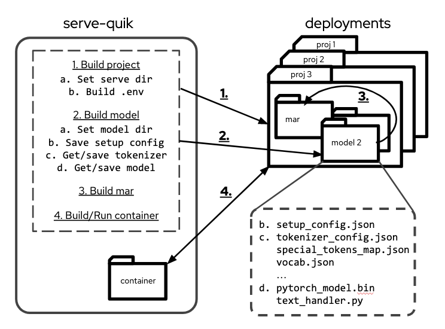

# serve-quik

For creating torch archived transformer models and TorchServe containers (much quik-er)

## Summary

### Quick Start

The process of building a torch model archive, building a torch serve container, determining the appropriate ports, and testing your container can be tedious, so I tried to create an automated process for all of this. Most of my automation is centered around MarianMT models, but can be used for other models (I use it for a BERT model). For instance, to build and deploy a container with some MarianMT models that will translate from Brazilian Portuguese, Chinese, French, German, Japanese, Korean, and Spanish to English, you could run the following:

``` bash
python serve-quik -p "text-translate" -mt marianmt -src ja de es fr bzs zh ko
```

Not only is everything set up, but the container is up and running on the server:

``` bash
$ docker ps --filter name=local_text_translate --format "table {{.Names}}\t{{.Image}}\t{{.RunningFor}}"
NAMES                  IMAGE                         CREATED
local_text_translate   serve-text-translate:latest   3 seconds ago
$ docker ps --filter name=local_text_translate --format "table {{.Ports}}"
PORTS
7070-7071/tcp, 8081/tcp, 0.0.0.0:8180->8080/tcp, :::8180->8080/tcp, 0.0.0.0:8182->8082/tcp, :::8182->8082/tcp
```

> **Note:** serve-quik realized that ports 8080 and 8082 were being used by the host, and built this container to use 8180 and 8182. For more information, see [Dockerfile automation](#dockerfile-automation)

### Inference Testing

Now the container is up and running, to test this, you can then run:

``` python
>>> import serve_quik as sq
>>> import pandas as pd
>>> import numpy as np
>>>
>>> PORT = 8180
>>>
>>> text_dict = {
...     "opus-mt-ja-en": ["口は災いの元"],
...     "opus-mt-de-en": ["Alles hat ein Ende, nur die Wurst hat zwei"],
...     "opus-mt-es-en": ["Es tan corto el amor y tan largo el olvido"],
...     "opus-mt-zh-en": [" 笑一笑,十年少"],
...     "opus-mt-fr-en": ["Dans une grande âme tout est grand"],
...     "opus-mt-bzs-en": ["Quando a alma fala, já não fala nada"],
...     "opus-mt-ko-en": ["멈추지 말고 계속 해나가기만 한다면 늦어도 상관없다."],
... }
>>> res = pd.DataFrame()
>>> for key, value in text_dict.items():
...     x = np.array(value, dtype='object')
...     url = f"http://localhost:{PORT}/predictions/{key}"
...     sr = sq.api.ServeRequest(x, 2, url)
...     df = sr.batch_inference()
...     res = pd.concat([res, df])
... 
INFO:serve_quik.api:Batch 0, status_code: 200
INFO:serve_quik.api:Batch 0, status_code: 200
INFO:serve_quik.api:Batch 0, status_code: 200
INFO:serve_quik.api:Batch 0, status_code: 200
INFO:serve_quik.api:Batch 0, status_code: 200
INFO:serve_quik.api:Batch 0, status_code: 200
INFO:serve_quik.api:Batch 0, status_code: 200
>>> print(res)
                                       translation
0                            The mouth is a curse.
0  Everything has an end, only the sausage has two
0       Love is so short and forgetfulness so long
0                       Smile. Ten years is short.
0              In a great soul everything is great
0      When the soul speaks, there is nothing else
0                   I don't care if it's too late.
```

## Process

Pretty cool right? But what exactly is being automated? Hypothetically, any `huggingface.co` tokenizer and model could be placed into a torch archive and served with TorchServe. serve-quik completes the following four steps for this to happen:

1. Builds a project directory
2. Builds a model directory (or multiple directories)
3. Builds a model-archive file
4. Builds and runs the serving container



### Set Directories

#### Build a project directory

Building a project directory allows all files/config required for a serving container to be located in one place. Doing this will both create the directory, but also let the rest of the process know where your project is stored. Second, there's a .env file added to the directory. This can be done manually, but there are automations if you use serve-quik. These are both done with:

``` python
from serve_quik import container, utils
serve_dir = utils.set_serve_dir(args.project_name)
container.build_dot_env(serve_dir)
```

#### Build a model directory

As multiple models can be served from a container, you can do this multiple times (e.g. different models for different translations). Here we'll just create the dir for later use. `args.module_type` can be something like "marianmt", and kwargs would be the source langage (e.g. "es") and the target language (e.g. "en"):

``` python
model_dir = utils.set_model_dir(
    serve_dir,
    args.model_type,
    args.kwargs
    )
```

### Pull and prepare tokenizer

I've only implemented BERT, RoBERTA, and MarianMT, but more are to come. The tokenizer functions do the following:
- maps a string to a model name and tokenizer, such as:
    - `bert` to `bert-base-uncased` and `BertTokenizer`
    - `roberta` to `roberta-base` and `RobertaTokenizer`
    - `marianmt` _(with source and target like es and en)_ to `Helsinki-NLP/opus-mt-es-en` and `MarianTokenizer`
- pulls the appropriate tokenizer, then converts the cached tokenizer files to the input files `config.json`, `tokenizer_config.json`, `special_tokens_map.json`, then does the same for the tokenizer specific files, such as :
    - `index_to_name.json`, `sample_text.txt`, `vocab.txt` for sequence_classification models
    - `vocab.json`, `source.spm` and `target.spm` for sequence_to_sequence models

### Pull and prepare a serialized model

To prepare a model, you pull it, add model weights, and then save it. If you are using the pretrained model as-is, you can just provide the weights already in the model. The steps are:
- mapping a string to a model name, such as:
    - `bert` to `BertForSequenceClassification`
    - `roberta` to `RobertaForSequenceClassification`
    - `marianmt` to `MarianMTModel`
- pulling the pretrained model
- builds the model archive's `setup_config.json` file with defaults

> **Note:** If you aren't providing your own trained weights (`state_dict`), you can just provide back the original weights to the pulled model `model.state_dict()`

### Choose a handler

Huggingface created a [great example handler](https://github.com/pytorch/serve/blob/master/examples/Huggingface_Transformers/Transformer_handler_generalized.py) which I used to use, but there are some `captum` dependencies that I don't use, and there's not an example for a sequence to sequence model like I use, so I rebuilt it. Feel free to use mine, but if you want to use your own, make sure to copy it into the directory where your mar files will be, and add `handler="yourhandlername.py` to `create_mar` in the next section.

### Build a Model Archive

PyTorch has a helpful feature called [Torch Model archiver for TorchServe](https://github.com/pytorch/serve/blob/master/model-archiver/README.md). It's a command line tool that will pull the 6+ tokenizer files, `setup_config.json`, and the serialized model (i.e. `pytorch_model.bin`) into one model archive (mar) file.

#### Setup

If you install `serve-quik`, it install this for you, but you should know it's a completely separate package you'd install:

``` bash
pip install torch-model-archiver
```

The command for creating the mar would be something like this:

``` bash
torch-model-archiver
    --model-name=text-translate
    --version=1.0
    --serialized-file= <serialized_file>
    --handler=<handler_file>
    --extra-files "<file_1><file_2><file_3><file_4><file_5><file_6>"
    --export-path=<export_dir}>
```

It seems simple, but the directory structure can make it difficult, so serve-quik does this for you. If you've saved your [tokenizer](#pull-and-prepare-tokenizer) and [model](#pull-and-prepare-a-serialized-model), then:

``` python
>>> import serve_quik as sq
>>> from pathlib import Path
>>>
>>> dir = Path.cwd().joinpath('opus-mt-en-es')
>>> sq.mar.create_mar(model_type="marianmt", model_dir=dir)
INFO:serve_quik.mar:torch archive opus-mt-en-es.mar created
```


### Dockerfile automation

Usually a container is built with a Dockerfile, docker-compose, or both. Although most TorchServe API containers are similar, there will always be differences, such as port numbers and container name. serve-quik takes these steps:

- _Determine ports_: Search for ports similar to the container's 8080 for the Inference API and 8082 for the Metrics API that aren't being used (in a **80 and **82 pattern)
- _Build `.env` file_: In order to use a common Dockerfile and docker-compose, a `.env` is built with `CONTAINER_DIR`, `IMAGE_NAME`, `CONTAINER_NAME`, `DIR_NAME`, `API_PORT`, and `METRIC_PORT`.
- _Build and start container_: Using the model archive directory, docker-compose directory, and `.env` file, build a torchserve container, and start it on the determined ports. the basic process is to `cd` to the `serve_quik/container` directory, and run:

``` bash
$ docker-compose --project-directory=<yourprojectdirectory> up --detach
```

serve-quik will figure this out for you, and you can just run:

``` python
import serve_quik as sq

dir = Path.cwd().joinpath('text-translation')
sq.container.start_container(dir)
```

To summarize, I have a `main.py` in serve_quik, but here is what you'd likely run:

```
import serve_quik as sq

LANGS = {source='es', target='en'}
serve_dir = sq.utils.set_serve_dir("text-translation")
model_dir = utils.set_model_dir(serve_dir, "marianmt", LANGS)
            )
sq.container.build_dot_env(serve_dir)

```